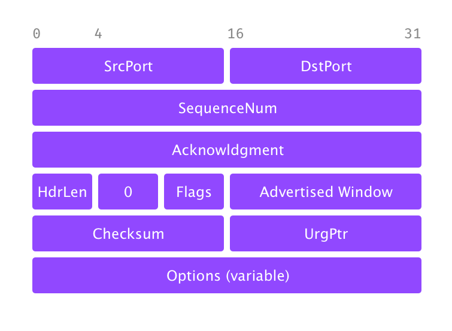
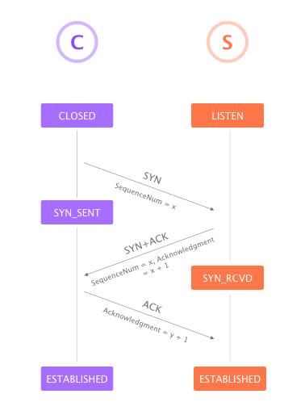
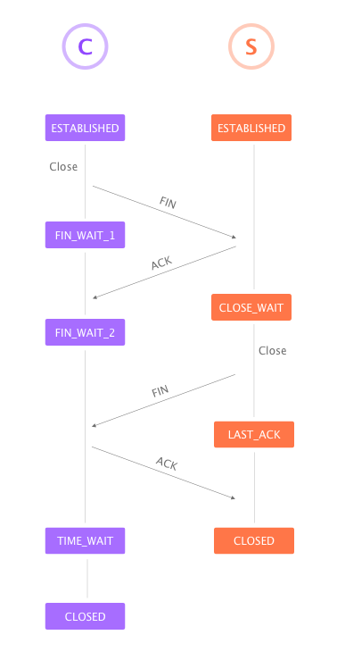

# TCP Segment



## 报文头字段
-  **SrcPort:** Source port
-  **DstPort:** Destination port
-  **SequenceNum:** Sequence number of first byte
-  **Acknowledgment:** Carry information about the flow of data going in the other direction
-  **AdvetisedWindow:** Carry information about the flow of data going in the other direction
-  **Flags:** Relay control information (`SYN`, `FIN`, `RESET`, `PUSH`, `URG`, `ACK`)
-  **Checksum:** Compute
-  **Hdrlen:** Offset

> 一句话总结：TCP 报文头总共包含 24 个字节：前 4个字节（`SrcPort`, `DstPort`）定义源端口和目标端口；11个字节（`SequenceNum`, `Acknowledgment` 和 `AdvertisedWindow`）用于 TCP 的 Sliding window algorithm。`Flags` 字段用于传输一些相应信息（例如建立和断开连接时用到的 `SYN`, `FIN` 和 `ACK`）。


# 建立和断开 TCP 连接 

> TCP 连接原则是时对称的，即两个端都有发起连接和断开的能力，但通常情况下会有一个端进行 Active open 主动开启连接而另一端进行 Passive open 被动接受连接

## 三次握手 



### 为什么需要三次握手：

- 由于 SequenceNum 是随机生成的数字，并不是从 0 开始，因此双方都需要确认对方的 sequenceNum 

- 从算法层面来说，至少需要三次的沟通才能让双方都确认并建立连接

> 注意：
> 如果客户端向服务端发出的 `ACK`，即第三次握手发送失败了，那客户端依然会成功进入 ESTABNLISHED 状态，也就是说本地应用可以正常传输数据。这些传输的数据都会带有一个 `ACK` 标识，以及正确的 `Acknowledgment` 信息，所以服务端在接收到这些数据后仍然可以正确建连接。

## 四次挥手 



### 为什么需要四次挥手：

TCP 连接的断开需要两端都进行中断，如果其中有一方关闭连接，那代表它已经没有需要传输的数据了，但它仍然可以接受数据。同时，考虑到有可能两端在同一时刻触发关闭操作，或者一方主动关闭后，另一方也立刻主动关闭，因此两端都分别需要 3 个状态转换才能进入终止状态。


# 滑动窗口

## 发送方数据


- `LastByteAcked`：最后一个已经被**确认发送成功**的字节。通常来说，在此之前的数据都可以认为已经全部发送成功。
- `LastByteSent`：最后一个**已经发送**的字节。通常来说它会在 `LastByteAcked` 之后或相等。`LastByteSent` 与 `LastByteAcked` 之间的数据已经发出但未得到接收方的 ACK。
- `LastByteWritten`：最后一个**写入**的字节。通常来说它会在 `LastByteSent` 之后或相等。`LastByteWritten` 与 `LastByteSent` 之间的数据会保存到缓冲区中等待发送。

它们满足以下条件：

```
LastByteAcked <= LastByteSent
LastByteSent <= LastByteWritten
```


## 接收方数据


- `LastByteRead`：最后一个**成功读取**的字节。通常来说，在此之前的数据都可以认为已经全部读取成功。
- `LastByteRcvd`：最后一个**成功接收到**的字节。通常来说它会在 `LastByteRead` 之后或相等。`LastByteRcvd` 与 `LastByteRead` 之间的数据会保存到缓冲区中等待读取，且必须小于缓冲区的最大容量。
- `NextByteExpected`：下一个**等待接收**的字节。通常来说，如果接收的数据都是按照正确顺序的话，它会是 `LastByteRcvd` 的下一个字节，但如果接收到的数据有部分是没有按顺序的话，它会是 `LastByteRead` 后第一个空数据位置。`NextByteExpected` 与 `LastByteRead` 之间的数据可以认为是全部有序且已经置入缓冲区的数据。

它们满足以下条件：

```
LastByteRead < NextByteExpected
NextByteExpected <= LastByteRcvd + 1

LastByteRcvd - LastByteRead <= MaxRcvBuffer
```


## Advertised Window

### 接收方

由于 `NextByteExpected` 与 `LastByteRead` 之间的数据已经置入缓冲区，因此接受方需要通知发送方缓冲区所能承载的数据大小：

```
AdvertisedWindow = MaxRcvBuffer - ((NextByteExpected - 1) - LastByteRead)
```


### 发送方

对于发送方来说，收到 `AdvertisedWindow` 后，根据当前的 `LastByteAcked` 和 `LastByteSent` 可以得出一个 `EffectiveWindow` ，这个窗口是发送方可以发送的数据大小。


```
LastByteSent - LastByteAcked <= AdvertisedWindow
EffectiveWindow = AdvertisedWindow - (LastByteSent - LastByteAcked)
```

> 注意：EffectiveWindow 必须大于 0 


同时，发送方也具有一个缓冲区来保存已经写入发送程序但还没有发送成功的数据，因此下一次尝试写入的数据 y 必须保证可以填入缓冲区


```
LastByteWritten - LastByteAcked <= MaxSendBuffer
y < MaxSendBuffer - (LastByteWritten - LastByteAcked)
```


