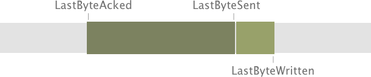
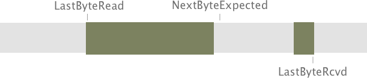
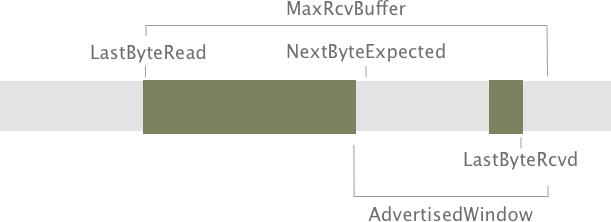
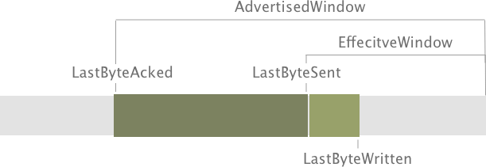
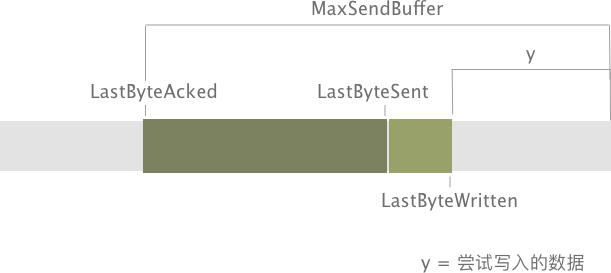
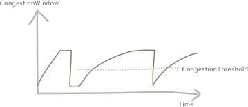

# TCP Segment


## 报文头字段
-  **SrcPort:** Source port
-  **DstPort:** Destination port
-  **SequenceNum:** Sequence number of first byte
-  **Acknowledgment:** Carry information about the flow of data going in the other direction
-  **AdvetisedWindow:** Carry information about the flow of data going in the other direction
-  **Flags:** Relay control information (`SYN`, `FIN`, `RESET`, `PUSH`, `URG`, `ACK`)
-  **Checksum:** Compute
-  **Hdrlen:** Offset

> 一句话总结：TCP 报文头总共包含 24 个字节：前 4个字节（`SrcPort`, `DstPort`）定义源端口和目标端口；11个字节（`SequenceNum`, `Acknowledgment` 和 `AdvertisedWindow`）用于 TCP 的 Sliding window algorithm。`Flags` 字段用于传输一些相应信息（例如建立和断开连接时用到的 `SYN`, `FIN` 和 `ACK`）。


# 建立和断开 TCP 连接 

> TCP 连接原则是时对称的，即两个端都有发起连接和断开的能力，但通常情况下会有一个端进行 Active open 主动开启连接而另一端进行 Passive open 被动接受连接

## 三次握手 

### 三次握手步骤

1. 客户端发起连接请求，发送一个特定的 segment 给服务端，其中 `SYN` 字段设置为 1，这个 segment 称为 SYN segment。同时，客户端随机选择一个序列数字设置到 `sequenceNumber` 字段，此变量称为 `client_isn`。
2. 服务端接收到客户端的连接请求，进行一系列初始化操作之后，发送确认连接的 segment 给客户端，此 segment 中 `SYN` 字段同样为 1，同时，`acknowledgment` 字段设置为 `clien_isn + 1`。同样，服务端也会选择一个随机数字作为 `server_isn`。
3. 客户端接收到服务端的 SYNACK segment，同时进行一系列初始化操作，最后发送一个确认连接的 segment 给服务端，此 segment 中的 `acknowledgement` 字段为 `server_isn + 1`。需要注意，在此步骤中，客户端可以在 payload 中携带数据。


### 为什么需要三次握手：

- 由于 SequenceNum 是随机生成的数字，并不是从 0 开始，因此双方都需要确认对方的 sequenceNum 

- 从算法层面来说，至少需要三次的沟通才能让双方都确认并建立连接

> 注意：
> 如果客户端向服务端发出的 `ACK`，即第三次握手发送失败了，那客户端依然会成功进入 ESTABNLISHED 状态，也就是说本地应用可以正常传输数据。这些传输的数据都会带有一个 `ACK` 标识，以及正确的 `Acknowledgment` 信息，所以服务端在接收到这些数据后仍然可以正确建连接。

### 三次握手的优化

#### SYN cookies
假设客户端同时发送大量的 SYN 请求给服务端，但最终并不完成这一次连接建立，服务端会不断地初始化资源并释放，造成巨大的不必要性能损耗，这种攻击称之为 Denial of Service (DoS) 攻击。这也是 TCP 三次握手的部分缺陷造成。

SYN cookies 的优化便解决了这种问题：

1. 当服务端接收到一个 SYN 请求时，它并不能确定这是一个有效的请求还是一次攻击中的请求。此时，服务端通过一个 hash 算法（通过 IP 地址和端口信息等）得出初始的 sequence number，这个数字会被当作“cookie”。然后服务端回复包含此 sequence number 的 SYNACK segment。
2. 一个合法的客户端在收到此 SYNACK segment 后，会回复 ACK segment。当服务端收到此 ACK，它会通过一样的 hash 算法得出之前的 sequence number（因为此数字不会保存在内存中），并与客户端回复的 acknowledge 值进行对比来验证。
3. 如果客户端没有回复 ACK segment，那么这次 SYN 请求并不会对服务端产生任何影响（没有资源消耗）。

#### TFO（TCP Fast Open）

TCP 快速打开策略是用于简化 TCP 握手步骤的策略。服务端会通过握手开始的 SYN segment 中的 TFO cookie 来验证一个客户端是否曾经连接过，验证成功的话，服务端可以在最后一次 ACK 收到之前开始传输数据。

1. 客户端发送包含 TFO 的 SYN segment，此时 cookie 为空，即首次请求 cookie。
2. 服务端生产加密的 cookie，并在 SYNACK segment 中返回给客户端。
3. 客户端缓存 cookie，并在下次请求时包含此 cookie。
4. 服务端对 cookie 进行校验，如果有效，则会在 SYNACK segment 中直接返回请求数据，否则只会发送 SYNACK segment 进行确认。
5. 重复此过程直至 cookie 失效。


## 四次挥手 


### 为什么需要四次挥手：

TCP 连接的断开需要两端都进行中断，如果其中有一方关闭连接，那代表它已经没有需要传输的数据了，但它仍然可以接受数据。同时，考虑到有可能两端在同一时刻触发关闭操作，或者一方主动关闭后，另一方也立刻主动关闭，因此两端都分别需要 3 个状态转换才能进入终止状态。


# 滑动窗口

## 发送方数据



- `LastByteAcked`：最后一个已经被**确认发送成功**的字节。通常来说，在此之前的数据都可以认为已经全部发送成功。
- `LastByteSent`：最后一个**已经发送**的字节。通常来说它会在 `LastByteAcked` 之后或相等。`LastByteSent` 与 `LastByteAcked` 之间的数据已经发出但未得到接收方的 ACK。
- `LastByteWritten`：最后一个**写入**的字节。通常来说它会在 `LastByteSent` 之后或相等。`LastByteWritten` 与 `LastByteSent` 之间的数据会保存到缓冲区中等待发送。

它们满足以下条件：

```
LastByteAcked <= LastByteSent
LastByteSent <= LastByteWritten
```


## 接收方数据



- `LastByteRead`：最后一个**成功读取**的字节。通常来说，在此之前的数据都可以认为已经全部读取成功。
- `LastByteRcvd`：最后一个**成功接收到**的字节。通常来说它会在 `LastByteRead` 之后或相等。`LastByteRcvd` 与 `LastByteRead` 之间的数据会保存到缓冲区中等待读取，且必须小于缓冲区的最大容量。
- `NextByteExpected`：下一个**等待接收**的字节。通常来说，如果接收的数据都是按照正确顺序的话，它会是 `LastByteRcvd` 的下一个字节，但如果接收到的数据有部分是没有按顺序的话，它会是 `LastByteRead` 后第一个空数据位置。`NextByteExpected` 与 `LastByteRead` 之间的数据可以认为是全部有序且已经置入缓冲区的数据。

它们满足以下条件：

```
LastByteRead < NextByteExpected
NextByteExpected <= LastByteRcvd + 1

LastByteRcvd - LastByteRead <= MaxRcvBuffer
```


## Advertised Window

### 接收方

由于 `NextByteExpected` 与 `LastByteRead` 之间的数据已经置入缓冲区，因此接受方需要通知发送方缓冲区所能承载的数据大小：

```
AdvertisedWindow = MaxRcvBuffer - ((NextByteExpected - 1) - LastByteRead)
```




### 发送方

对于发送方来说，收到 `AdvertisedWindow` 后，根据当前的 `LastByteAcked` 和 `LastByteSent` 可以得出一个 `EffectiveWindow` ，这个窗口是发送方可以发送的数据大小。


```
LastByteSent - LastByteAcked <= AdvertisedWindow
EffectiveWindow = AdvertisedWindow - (LastByteSent - LastByteAcked)
```

> 注意：EffectiveWindow 必须大于 0 



同时，发送方也具有一个缓冲区来保存已经写入发送程序但还没有发送成功的数据，因此下一次尝试写入的数据 y 必须保证可以填入缓冲区


```
LastByteWritten - LastByteAcked <= MaxSendBuffer
y < MaxSendBuffer - (LastByteWritten - LastByteAcked)
```



# 重传机制（Retransmission）

由于 TCP 是可靠的传输协议，因此当发送方没有在某个时间内收到接收方发送的 ACK，发送方会尝试重新传输上一次的数据。这个超时时间为 `EstimatedRTT` 的 2 倍，它是由以下公式计算得出：


```
EstimatedRTT = alpha x EstimatedRTT + (1 - alpha) x SampleRTT
TimeOut = 2 x EstimatedRTT

```

> 注意：公式右边的 EstimatedRTT 为上一次计算得出的结果；SampleRTT 为上一次发送的时间和最近一次接收到 ACK 的时间差；alpha 通常为 0.8-0.9，其作用主要是用于调整 EstimatedRTT


## Karn/Partridge 算法

由于普通的重传算法有一个致命的问题：如果接收方的 ACK 延迟，且发送方已经触发了重传后才接收到 ACK，那么下一次计算的 EstimatedRTT 会出现错误。

Karn 的解决方法是：**当重传触发时，停止计算 EstimatedRTT，并且 SampleRTT 仅使用只发送了一次的数据来计算。**


# 拥塞避免 Congestion Control

## CongestionWindow 的增长与减少

- `CongestionWindow` 的增长速度和 1 个 packet 的大小有关。
- `CongestionWindow` 的减少通常为直接减半

### 线性增长

` CongestionWindow` 的值随着时间线性增长，每次增长 1 个 packet 大小。

### Slow start

Slow start 的增长通常有 2 种情况：

- 在每个 ACK 后，`CongestionWindow` 的值翻倍增长直到达到 `CongestionThreshold`（通常 在 Timeout 发生后，此时已经具有一个之前 的 `CongestionThreshold` 值）
- 在每个 RTT 中，`CongestionWindow` 的值翻倍增长直到 出现丢包或 timeout（通常在连接开始的初期，没有任何关于网络状况的信息时）
- 

## Timeout 发生



- `CongestionThreshold`：当 timeout 发生时，congestion window 的值会减少一半，CongestionThreshold 会设置为这个值。
- `CongestionWindow` 会重置为 1 个 packet 的大小，然后开始 slow start
- 当 `CongestionWindow` 达到 `CongestionThreshold` 的值后，开始线性增长


## 测试题

> 假设当以下情况发生时，某个 TCP 连接的 congestion window 大小为 32 KB：
>
> - Timout
> - 接收到 3 个 `ACK`
>
> 且这个连接的 RTT = 100 ms，MSS = 2 KB，那么此连接的 congestion window 大小回到 32 KB 所需要的时间约为 __ 和 __ 之间。

第一种 Timeout 的情况， congestion window 的大小会直接缩减至最小，即为 1 个 packet 的大小，也就是 2 KB。

此时，congestion window 会在每次 ACK 后翻倍，直到达到 congestion threshold 也就是 16 KB。然后开始线性增长，即每个 ACK 增长 1 个 packet 的大小：

|                Congestion window size (KB)             |      ACKs |
| --------------------------- | ---- |
| 2                           | 1    |
| 4                           | 2    |
| 8                           | 3    |
| 16 (Congestion threshold)   | 4    |
| 18                          | 5    |
| 20                          | 6    |
| 22                          | 7    |
| 24                          | 8    |
| 26                          | 9    |
| 28                          | 10   |
| 30                          | 11   |
| 32                          | 12   |

因此，所需时间为 

$$
12 * 100 ms = 1200 ms
$$

第二种情况，当收到 3 个 ACK 后，此时 Congestion Window 为 8 KB：

|                Congestion window size (KB)             |      ACKs |
| --------------------------- | ---- |
| 16 (Congestion threshold)   | 1    |
| 18                          | 2    |
| 20                          | 3    |
| 22                          | 4    |
| 24                          | 5    |
| 26                          | 6    |
| 28                          | 7   |
| 30                          | 8   |
| 32                          | 9   |

因此，所需时间为 

$$
9 * 100 ms = 900 ms
$$

